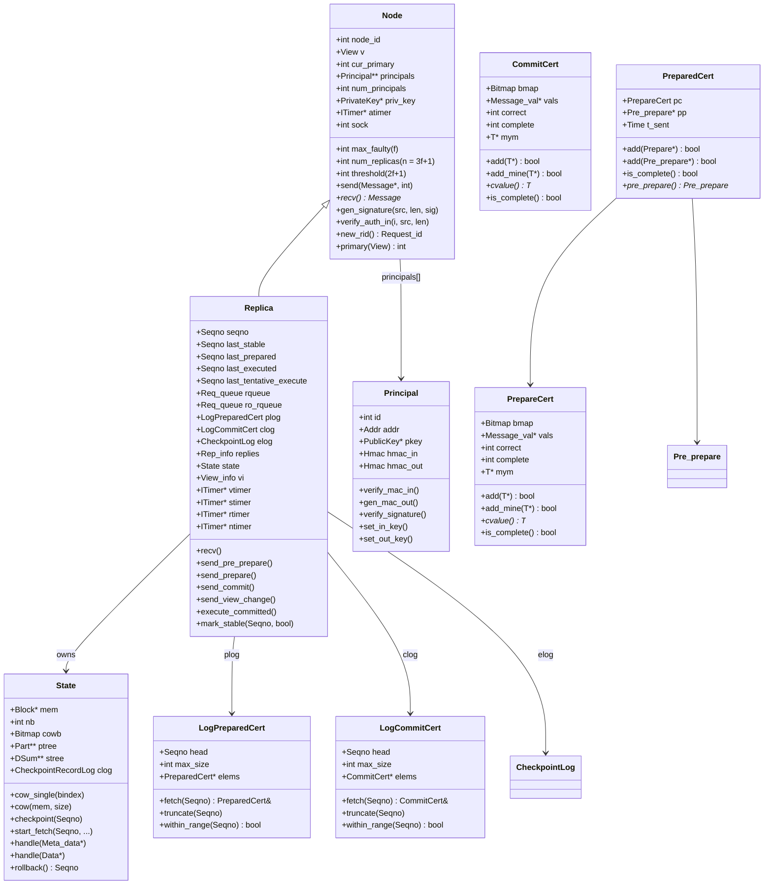
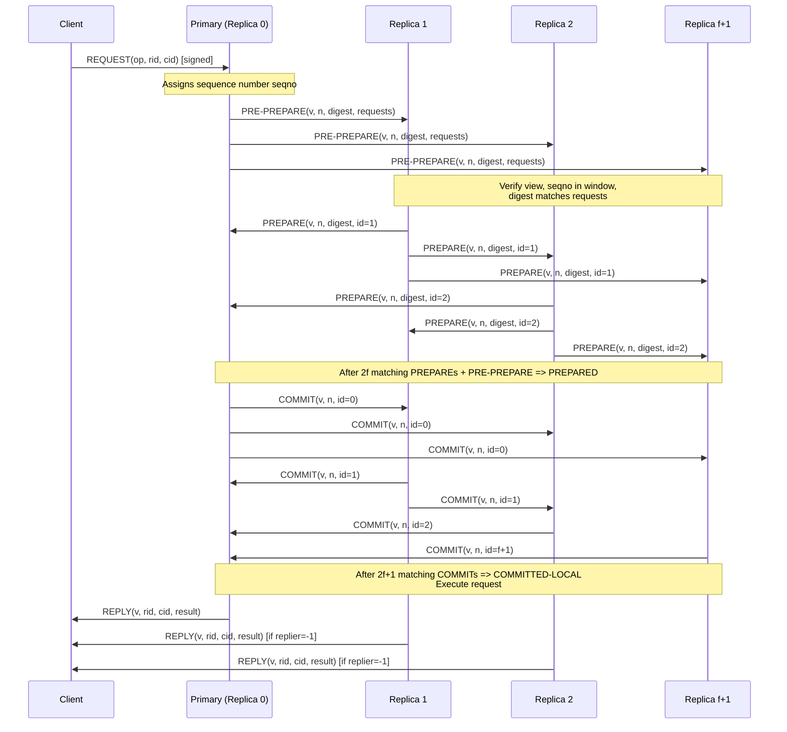
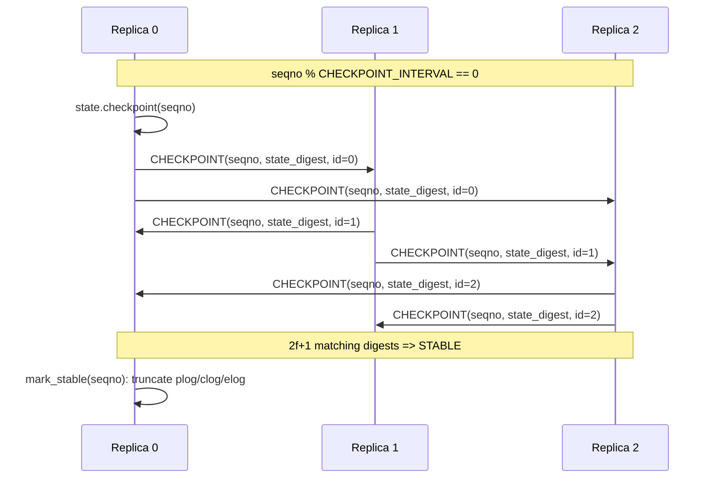
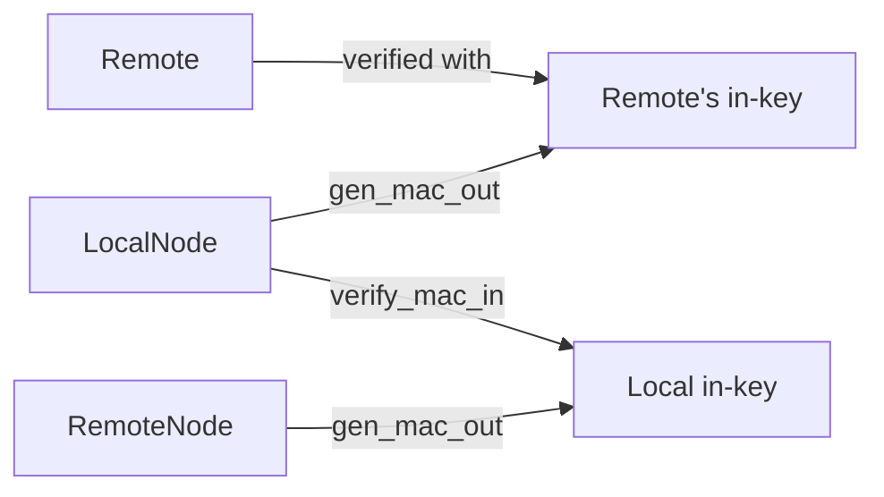
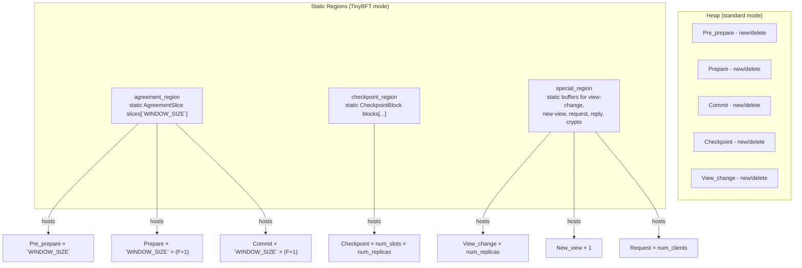
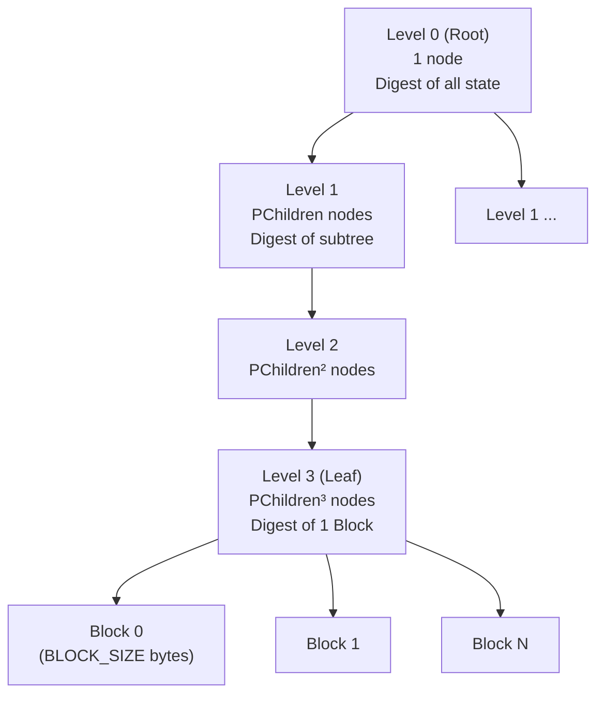
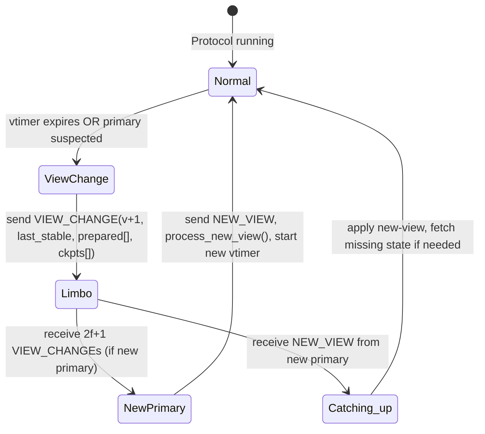
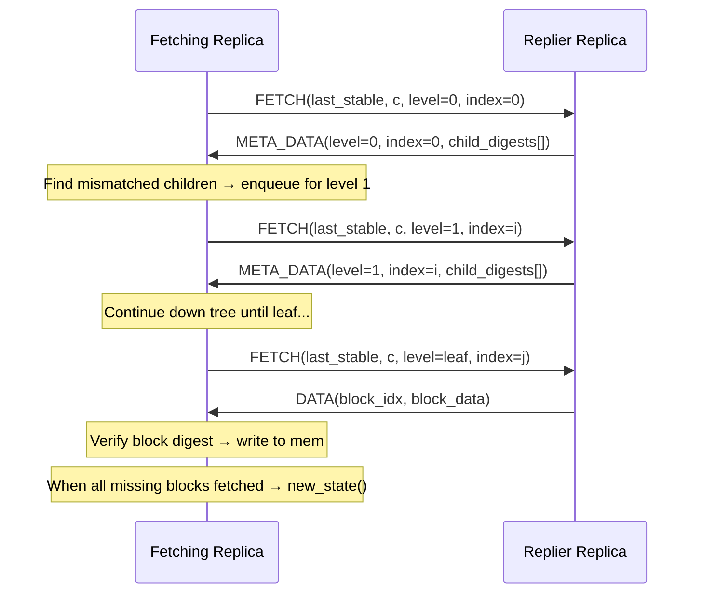
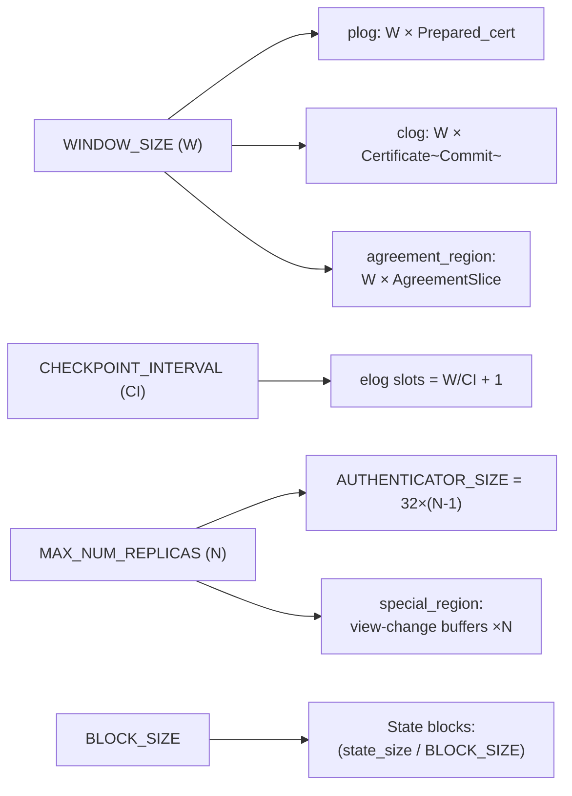

# TinyBFT Architecture & Developer Documentation

> TinyBFT is a memory-optimized Byzantine Fault-Tolerant (BFT) library for embedded systems, based on MIT's PBFT (`libbyz`). It replaces the `sfslite` crypto library with **MbedTLS** and introduces static memory regions to drastically reduce dynamic allocation.

---

## Table of Contents

1. [Overview](#1-overview)
2. [Class Hierarchy Diagram](#2-class-hierarchy-diagram)
3. [PBFT Protocol Flow](#3-pbft-protocol-flow)
4. [Message Types Reference](#4-message-types-reference)
5. [Core Classes](#5-core-classes)
   - [Node](#node)
   - [Replica](#replica)
   - [Principal](#principal)
   - [State](#state)
6. [Certificate & Log Abstractions](#6-certificate--log-abstractions)
7. [TinyBFT Memory Optimizations](#7-tinybft-memory-optimizations)
   - [agreement_region](#agreement_region)
   - [checkpoint_region](#checkpoint_region)
   - [special_region](#special_region)
   - [Dynamic Partition Tree](#dynamic-partition-tree)
8. [State Partitioning & Merkle Tree](#8-state-partitioning--merkle-tree)
9. [View Change Protocol](#9-view-change-protocol)
10. [State Transfer Protocol](#10-state-transfer-protocol)
11. [Build Configuration Reference](#11-build-configuration-reference)
12. [Runtime Configuration File Format](#12-runtime-configuration-file-format)
13. [Public API (`libbyz.h`)](#13-public-api-libbyzh)

---

## 1. Overview

TinyBFT implements a **PBFT (Practical Byzantine Fault Tolerance)** protocol where a cluster of `n = 3f + 1` replicas can tolerate up to `f` Byzantine-faulty nodes. Clients send requests to the cluster; the primary replica sequences them, and all replicas agree on the ordering via a three-phase protocol (Pre-Prepare → Prepare → Commit) before executing and replying.

### Key Design Goals

| Goal | Approach |
|------|----------|
| Tolerate `f` Byzantine faults | `n = 3f + 1` replicas, `2f + 1` quorums |
| Minimise dynamic memory | Static memory regions (`agreement_region`, `checkpoint_region`, `special_region`) |
| Embedded compatibility | MbedTLS, configurable `BLOCK_SIZE`, `WINDOW_SIZE`, `MAX_NUM_REPLICAS` |
| Correct state recovery | Merkle-tree over state blocks, fetch protocol, view-change safety |
| Low bandwidth | Authenticators (HMAC) instead of full RSA signatures in hot path |

---

## 2. Class Hierarchy Diagram



---

## 3. PBFT Protocol Flow

### 3.1 Normal-Case Operation (Three-Phase Commit)



### 3.2 Checkpoint Stabilization

Every `CHECKPOINT_INTERVAL` (default: 128) sequence numbers, all replicas broadcast a `CHECKPOINT` message with the state digest. When `2f + 1` matching Checkpoints are received, that checkpoint becomes **stable** and older log entries are garbage collected.



---

## 4. Message Types Reference

All messages extend `Message` and share a common wire header `Message_rep { short tag; short extra; int size; }`.

| Tag | Class | Fields | Direction | Purpose |
|-----|-------|--------|-----------|---------|
| 1 | `Request` | `od` (digest), `cid`, `rid`, `replier`, `command_size` | Client → Primary | Client operation request |
| 2 | `Reply` | `view`, `seqno`, `cid`, `rid` | Replica → Client | Response to client |
| 3 | `Pre_prepare` | `view`, `seqno`, `digest`, `rset_size`, `non_det_size` | Primary → Replicas | Phase 1: propose ordering |
| 4 | `Prepare` | `view`, `seqno`, `digest`, `id` | Replica → All | Phase 2: vote for ordering |
| 5 | `Commit` | `view`, `seqno`, `id` | Replica → All | Phase 3: commit ordering |
| 6 | `Checkpoint` | `seqno`, `digest`, `id` | Replica → All | Stable checkpoint announcement |
| 7 | `Status` | various | Replica → All | Periodic status summary |
| 8 | `View_change` | `v`, `ls`, `ckpts[]`, `n_reqs`, `prepared[]` | Replica → All | Trigger view change |
| 9 | `New_view` | `v`, `min`, `max`, `prepared[]` | New Primary → All | Commit new view |
| 10 | `View_change_ack` | `v`, `id`, `vc_id` | Replica → New Primary | Acknowledge view-change msg |
| 11 | `New_key` | authenticator | Replica → All | Rotate session keys |
| 12 | `Meta_data` | level, index, partition hashes | Replica → Fetching | State hash tree node |
| 13 | `Meta_data_d` | digests | Replica → Fetching | Directory-level state info |
| 14 | `Data` | block index, block data | Replica → Fetching | State block payload |
| 15 | `Fetch` | `last_stable`, `c`, `level`, `index` | Fetching → Replier | Request state transfer |
| 16 | `Query_stable` | `rid` | Replica → All | Estimate max stable seqno |
| 17 | `Reply_stable` | `seqno`, `rid` | Replica → Querier | Answer stable estimate |

### Message Wire Layout (Pre_prepare)

```
┌─────────────────────────────────────────────────────────────┐
│ Message_rep  │ tag=3 │ extra │ size (8-byte aligned)        │
├─────────────────────────────────────────────────────────────┤
│ Pre_prepare_rep                                             │
│   view (View/Seqno = int64)                                 │
│   seqno (Seqno)                                             │
│   digest (32 bytes, SHA-256)                                │
│   rset_size (int)                                           │
│   non_det_size (short)                                      │
├─────────────────────────────────────────────────────────────┤
│ request set [rset_size bytes]                               │
│   [ Request_rep | command | signature ] * N                 │
├─────────────────────────────────────────────────────────────┤
│ non-deterministic choices [non_det_size bytes]              │
├─────────────────────────────────────────────────────────────┤
│ authenticator (HMAC × num_replicas OR RSA sig)              │
└─────────────────────────────────────────────────────────────┘
```

---

## 5. Core Classes

### Node

**File:** `src/Node.h` / `src/Node.cc`

Base class for all participants (both replicas and clients). Owns the cryptographic identity of the local node and manages UDP socket communication.

**Key fields:**

| Field | Type | Description |
|-------|------|-------------|
| `node_id` | `int` | This node's identifier in the cluster |
| `max_faulty` (`f`) | `int` | Maximum byzantine faults tolerated |
| `num_replicas` (`n`) | `int` | `n = 3f + 1` |
| `threshold` | `int` | `2f + 1` (quorum size) |
| `v` | `View` | Current view number |
| `cur_primary` | `int` | `v % num_replicas` |
| `principals[]` | `Principal**` | All known principals (replicas first, then clients) |
| `priv_key` | `PrivateKey*` | Node's RSA private key (MbedTLS) |
| `atimer` | `ITimer*` | Authentication freshness timer |
| `sock` | `int` | UDP socket fd |

**Key methods:**

```
send(Message* m, int i)      // send to principal i, or All_replicas (-1) via multicast/unicast
recv() → Message*            // blocking recv (handles timers)
gen_signature(src, len, sig) // RSA sign
gen_auth_in/out(src, len)    // HMAC authenticator generation
verify_auth_in/out(i, ...)   // HMAC authenticator verification
new_rid() → Request_id       // monotonically increasing request ID
primary(View v) → int        // v % num_replicas
```

---

### Replica

**File:** `src/Replica.h` / `src/Replica.cc`

The heart of the library. Extends `Node`. Manages the full PBFT state machine including: request queuing, the prepared/commit log, checkpoint management, view-change, state transfer, and recovery.

**Key state fields:**

| Field | Type | Description |
|-------|------|-------------|
| `seqno` | `Seqno` | Next outgoing sequence number (primary only) |
| `last_stable` | `Seqno` | Sequence number of last stable checkpoint |
| `last_prepared` | `Seqno` | Highest prepared seqno |
| `last_executed` | `Seqno` | Highest committed+executed seqno |
| `last_tentative_execute` | `Seqno` | Highest tentatively executed seqno |
| `rqueue` / `ro_rqueue` | `Req_queue` | R/W and read-only request queues |
| `plog` | `Log<Prepared_cert>` | Prepared certificates, one per seqno slot |
| `clog` | `Log<Certificate<Commit>>` | Commit certificates |
| `elog` | `CheckpointLog` (TinyBFT) or `Log<Certificate<Checkpoint>>` | Checkpoint certificates |
| `replies` | `Rep_info` | Last reply sent to each client |
| `state` | `State` | Manages copy-on-write and state fetch |
| `vi` | `View_info` | View-change protocol state |
| `vtimer` | `ITimer*` | View-change timeout |
| `stimer` | `ITimer*` | Status broadcast timer |
| `rtimer` | `ITimer*` | Recovery timer |
| `ntimer` | `ITimer*` | Null-request (keep-alive) timer |
| `se` | `Stable_estimator` | Estimates max stable checkpoint at any replica |

**Handler dispatch (via message tag):**

```cpp
// Replica::recv() dispatches via gen_handle<T>(m):
handle(Request*)         handle(Pre_prepare*)
handle(Prepare*)         handle(Commit*)
handle(Checkpoint*)      handle(View_change*)
handle(New_view*)        handle(View_change_ack*)
handle(Status*)          handle(New_key*)
handle(Fetch*)           handle(Data*)
handle(Meta_data*)       handle(Meta_data_d*)
handle(Reply*)           handle(Query_stable*)
handle(Reply_stable*)
```

**Sequence number window invariant:**
> A message is "in window" (`in_w(m)`) iff `last_stable < m.seqno <= last_stable + WINDOW_SIZE`

---

### Principal

**File:** `src/Principal.h` / `src/Principal.cc`

Represents a remote peer. Stores the peer's IP address, RSA public key, and symmetric HMAC session keys (in-key for messages received *from* this principal, out-key for messages *to* it).



Authentication flow:
1. HMAC MACs are preferred (fast, `HMAC_size = 32 bytes`).
2. RSA signatures are generated for `Request`, `View_change`, and other infrequently-signed messages.
3. Session keys are rotated via `New_key` messages, protected with RSA encryption.

---

### State

**File:** `src/State.h` / `src/State.cc`

Manages the replica's **application state** as a flat array of fixed-size `Block`s (default 4096 bytes each). Provides:

- **Copy-on-Write (CoW):** Before any write to a block, `cow_single(bindex)` saves a snapshot so the previous checkpoint can always be reconstructed.
- **Merkle-style Digest Tree:** `ptree` (partition tree of `Part` nodes) and `stree` (sum tree of digests) allow efficient incremental digest updates and fast detection of divergent state during fetch.
- **Checkpoint Snapshots:** `clog` holds `CheckpointRecord` entries (one per checkpoint interval) with digests and old block copies.
- **Fetch Protocol:** When fetching, `in_fetch_state()` is true; `Meta_data`, `Meta_data_d`, and `Data` messages are received to reconstruct the Merkle tree bottom-up.

---

## 6. Certificate & Log Abstractions

### `Certificate<T>` (template)

**File:** `src/Certificate.h`

A quorum certificate: collects at most one message per replica sender, groups identical messages, and becomes **complete** once `complete` (default: `2f+1`) matching messages are received.

```
is_complete() := num_correct() >= complete
```

Internally stores distinct values in `vals[]` (up to `f+1` slots, since beyond that a quorum is guaranteed). Tracks which replica IDs have sent a message using a `Bitmap`.

Used as:
- `Certificate<Commit>` in `clog` (commit log)
- `Certificate<Checkpoint>` in `elog` (checkpoint log, standard mode)
- `Certificate<Reply>` for recovery replies

### `Prepared_cert`

**File:** `src/Prepared_cert.h`

Combines a `Pre_prepare*` with a `Certificate<Prepare>` (prepare certificate). The certificate is **complete** when:
- `pp != nullptr` (pre-prepare received)
- `pc.is_complete()` (at least `2f` matching prepares)
- `pp->match(pc.cvalue())` (prepare digests match pre-prepare digest)

### `Log<T>` (template)

**File:** `src/Log.h`

A circular buffer of `max_out` (= `WINDOW_SIZE`, default 256) entries indexed by sequence number. Access uses `seqno & mask` (power-of-2 modulo). Used as:

- `Log<Prepared_cert> plog` — per-seqno prepared certs
- `Log<Certificate<Commit>> clog` — per-seqno commit certs
- `Log<Certificate<Checkpoint>> elog` — per-checkpoint checkpoint certs (standard mode)

---

## 7. TinyBFT Memory Optimizations

TinyBFT mode (enabled with `-DTINY_BFT=1`) replaces dynamic heap allocation of protocol messages with **static, pre-allocated memory regions**. This is critical for embedded systems with no or limited heap.



**Defined compile-time flags:**

| Flag | Effect |
|------|--------|
| `STATIC_LOG_ALLOCATOR` | Use static regions instead of `Log_allocator` heap |
| `ALTERNATIVE_CHECKPOINT_LOG` | Use `CheckpointLog` instead of `Log<Certificate<Checkpoint>>` |
| `ALTERNATIVE_CHECKPOINT_RECORDS` | Use `CheckpointRecordLog` instead of `Log<Checkpoint_rec>` in State |
| `DYNAMIC_PARTITION_TREE` | Compute partition tree dimensions at runtime from state size |

### `agreement_region`

**File:** `src/agreement_region.h` / `src/agreement_region.cc`

A static circular buffer of `AgreementSlice[WINDOW_SIZE]` entries. Each slice holds one `PreparedCert` (1 Pre_prepare + F+1 Prepares) and one `CommitCert` (F+1 Commits).

```cpp
struct AgreementSlice {
    PreparedCert prepared_cert;   // Pre_prepare + (F+1) Prepares
    CommitCert   commit_cert;     // (F+1) Commits
};
static AgreementSlice slices[max_out];  // max_out = WINDOW_SIZE
```

Indexing uses `cert_index(n) = (head_index + (n - head)) % max_out`. The `truncate(new_head)` function advances the head when sequences are garbage collected after a stable checkpoint.

**API:**
```cpp
Pre_prepare* new_pre_prepare(View v, Seqno n, Req_queue& req);
Pre_prepare* load_pre_prepare(Seqno n);
void         store_pre_prepare(Pre_prepare* pp);
Prepare*     load_prepare(Seqno n, size_t i);  // i-th prepare slot
void         store_prepare(Prepare* p, size_t i);
Commit*      load_commit(Seqno n, size_t i);
void         store_commit(Commit* c, size_t i);
void         truncate(Seqno new_head);
bool         within_range(Seqno seqno);
```

### `checkpoint_region`

**File:** `src/checkpoint_region.h` / `src/checkpoint_region.cc`

Static storage for `Checkpoint` messages per sequence number slot, indexed by `(seqno / checkpoint_interval) % num_slots`. Also stores "above window" checkpoints (from ahead-of-window replicas) per replica ID.

**API:**
```cpp
Checkpoint* load_checkpoint(Seqno seqno, size_t i);
void        store_checkpoint(Checkpoint* c, size_t i);
Checkpoint* load_above_window(size_t replica_id);
void        store_above_window(Checkpoint* c);
void        truncate(Seqno seqno);
```

### `special_region`

**File:** `src/special_region.h` / `src/special_region.cc`

Stores all remaining protocol messages that do not fit into the hot-path `agreement_region`:

| Sub-region | Contents |
|-----------|----------|
| Checkpoints | Overflow checkpoint storage |
| View | `View_change[num_replicas]`, `View_change_ack[num_replicas][num_replicas]`, `New_view` |
| Crypto | `New_key` message |
| Requests | `Request[max_num_clients]`, `Reply[num_clients]` |

### Dynamic Partition Tree

**File:** `src/Partition.h` / `src/Partition.cc`

Standard mode uses compile-time constants (`PLevels=4`, `PChildren=256`). With `DYNAMIC_PARTITION_TREE`, the partition tree dimensions are computed at runtime from the actual number of state blocks:

```
PChildren = (Max_message_size - sizeof(Meta_data_rep)) / sizeof(Part_info)
PLevels   = computed to fit all blocks in tree
```

This allows the library to adapt to the actual state size without wasting memory for a fixed deep tree when the state is small.

---

## 8. State Partitioning & Merkle Tree

The state is subdivided into a Merkle-like tree for efficient digest computation and incremental state transfer.



- `ptree[l][i]` stores `Part` (digest + version) for partition `(l, i)`.
- `stree[l][i]` stores `DSum` (sum of child digests) for fast incremental update.
- Copy-on-Write bitmap `cowb`: bit `i` = 0 means block `i` must be copied before modification; bit = 1 after copy.
- When `checkpoint(seqno)` is called: blocks with modified cow-bits get new digests, stree/ptree updated, overall state digest computed.

---

## 9. View Change Protocol

Triggered when `vtimer` expires (replica suspects primary is faulty).



**`View_change` message contents** (`View_change_rep`):
- `v`: new view number being proposed
- `ls`: sequence number of sender's last stable checkpoint
- `ckpts[n_ckpts]`: digests of all checkpoints in `[ls, ls + max_out]`
- `prepared[prepared_size]`: bitmap of which seqnos are prepared
- `req_info[n_reqs]`: `{lv, v, digest}` for each request referenced

**New primary selection:** `new_primary = v % num_replicas`

**`View_info`** (`src/View_info.h`) manages:
- Collecting 2f+1 view-change messages
- Determining safe min/max seqno range
- Constructing and verifying `New_view`

---

## 10. State Transfer Protocol

When a replica falls behind or detects corruption, it fetches missing state:



The replier is selected randomly and rotated if no response arrives within 100ms (`retrans_fetch`).

---

## 11. Build Configuration Reference

| CMake Variable | Default | Description |
|----------------|---------|-------------|
| `TINY_BFT` | off | Enable TinyBFT static memory optimizations |
| `MAX_MESSAGE_SIZE` | 16384 | Maximum UDP message size in bytes (must fit view-change messages) |
| `MAX_REPLY_SIZE` | 1240 | Maximum reply payload size (< `MAX_MESSAGE_SIZE`) |
| `BLOCK_SIZE` | 4096 | State page/block size (power of 2, ≤ page size) |
| `MAX_NUM_REPLICAS` | 32 | Max replicas supported (affects data structure sizing) |
| `WINDOW_SIZE` | 256 | Number of in-flight sequence numbers |
| `CHECKPOINT_INTERVAL` | 128 | Seqno interval between checkpoints |
| `MAX_NUM_CLIENTS` | 1 | Max clients (TinyBFT static regions) |
| `MAX_REQUEST_SIZE` | derived | Max command payload |
| `DISABLE_MULTICAST` | off | Use unicast instead of multicast |
| `PRINT_PERF_STATISTICS` | off | Enable `Statistics.cc` cycle counters |
| `PRINT_MEM_STATISTICS` | off | Enable custom `malloc` tracking |
| `MBEDTLS_INCLUDE_PATH` | system | Override MbedTLS include path |

### Compile-Time Validation

The build system enforces correct configuration via static assertions:

| Assertion | Requirement |
|-----------|-------------|
| `BLOCK_SIZE` | Must be a power of two (e.g., 4096) |
| `WINDOW_SIZE > CHECKPOINT_INTERVAL` | Protocol requires window larger than checkpoint interval |
| `max_view_change_size <= MAX_MESSAGE_SIZE` | View-change messages must fit in UDP packets |
| `max_new_view_size <= MAX_MESSAGE_SIZE` | New-view messages must fit in UDP packets |
| `max_request_size <= MAX_MESSAGE_SIZE` | Request messages must fit in UDP packets |

If any assertion fails, compilation will error with a clear message indicating the constraint violation.

### Memory Impact Summary



---

## 12. Runtime Configuration File Format

Config file read in `Node::Node()` on startup. Lines are:

```
<service_name>          # arbitrary ASCII string, e.g., "generic"
<f>                     # max faulty replicas (integer)
<auth_timeout_ms>       # authentication freshness timeout
<num_nodes>             # total nodes (replicas + clients)
<multicast_ip>          # multicast group IP (e.g., 234.5.6.8)
<host1> <ip1> <port1> <pub_key1_path>   # replica 0
<host2> <ip2> <port2> <pub_key2_path>   # replica 1
...                                      # (num_nodes total node lines)
<view_change_timeout_ms>
<status_timeout_ms>
<recovery_timeout_ms>
```

Replica nodes are listed first (indices `0..n-1`), then clients (`n..num_nodes-1`). The reading replica matches its own entry by IP address (and optionally `port` if non-zero).

---

## 13. Public API (`libbyz.h`)

### Client API

```c
// Initialize client
int Byz_init_client(const char *conf, const char *conf_priv, short port);

// Allocate a request buffer
int Byz_alloc_request(Byz_req *req, int size);

// Set req->contents[0..req->size-1] = command data, then:
int Byz_send_request(Byz_req *req, bool ro);

// Wait for f+1 matching replies
int Byz_recv_reply(Byz_rep *rep);

// Convenience: send + recv in one call
int Byz_invoke(Byz_req *req, Byz_rep *rep, bool ro);

// Cleanup
void Byz_free_request(Byz_req *req);
void Byz_free_reply(Byz_rep *rep);
void Byz_reset_client();
```

### Replica API

```c
// Initialize replica (NO_STATE_TRANSLATION mode)
int Byz_init_replica(const char *conf, const char *conf_priv,
                     char *mem, unsigned int size,
                     int (*exec)(Byz_req*, Byz_rep*, Byz_buffer*, int, bool),
                     void (*comp_ndet)(Seqno, Byz_buffer*),
                     int ndet_max_len,
                     int (*recv_reply)(Byz_rep*),
                     short port);

// Notify library before modifying state
void Byz_modify(char *mem, int size);       // general
#define Byz_modify1(mem)                    // single-block shortcut
#define Byz_modify2(mem, size)              // two-block shortcut

// Run the replica event loop
void Byz_replica_run();

// Statistics
void Byz_reset_stats();
void Byz_print_stats();
```

### Callback Signatures

```c
// Execute a committed request
int exec(Byz_req *req, Byz_rep *rep, Byz_buffer *ndet, int client, bool read_only);
// Returns 0 on success, -1 if read_only but request is not read-only.

// Compute non-deterministic choices for a sequence number
void comp_ndet(Seqno seqno, Byz_buffer *ndet);
// Fill ndet->contents[0..ndet->size-1], set ndet->size to actual length.
```

### `Byz_buffer` / `Byz_req` / `Byz_rep`

```c
struct Byz_buffer_t {
    int   size;      // number of valid bytes in contents
    char *contents;  // pointer to the data buffer
    void *opaque;    // library-internal use
};

typedef struct Byz_buffer_t Byz_buffer;
typedef Byz_buffer Byz_req;
typedef Byz_buffer Byz_rep;
```

---

## Appendix: Key Type Aliases (`types.h`)

| Typedef | Underlying | Description |
|---------|-----------|-------------|
| `Seqno` | `long long` | Protocol sequence number |
| `View` | `Seqno` | View number (same type) |
| `Request_id` | `unsigned long long` | Unique per-client request ID |
| `Addr` | `struct sockaddr_in` | Network address |
| `Long` | `long long` | Signed 64-bit |
| `ULong` | `unsigned long long` | Unsigned 64-bit |

---

*Generated from source code analysis of TinyBFT v0.0.1. All class/field names are exact matches to the source.*
